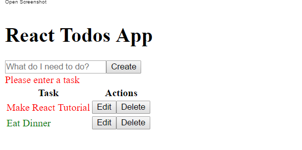

### Build Todo App React 

A todo app built using react with the help of 
[Learn Coding Tutorial's -  React Tutorial (with Webpack + ES6): Build a ToDo App with Best Practices](https://www.youtube.com/watch?v=IR6smI_YJDE)

I used Create-react-app to get started. 

#### Usage

- npm install
- npm run start 

